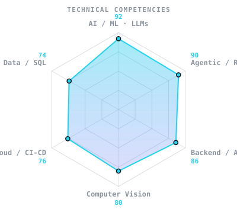
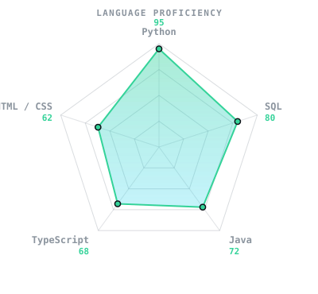
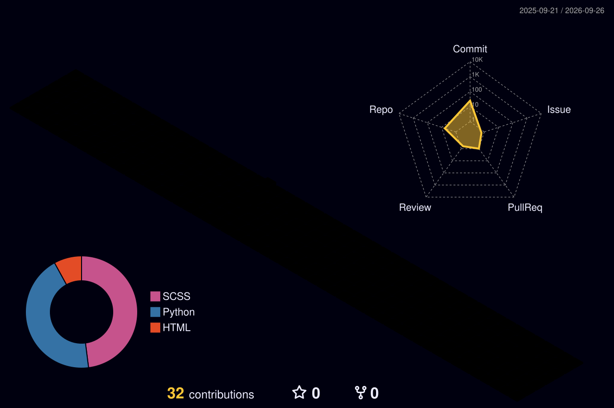

<div align="center">

<!-- Colour halftone, sampled per dot from the photo. Two files: the dark
     variant lifts every channel toward white so the hair does not vanish
     into a dark background. -->
<picture>
  <source media="(prefers-color-scheme: dark)" srcset="./portrait-dark.svg">
  
</picture>


<p>
<a href="https://byruvishwajitha-portfolio.vercel.app/"></a>
<a href="https://www.linkedin.com/in/vishwajithabyru28/"></a>
<a href="mailto:byruvishwajitha@gmail.com"></a>
<a href="https://github.com/VISHWAJITHA28"></a>

</p>

```
01000001 01001001 00100000 01100110 01101111 01110010 00100000 01101101 01100101 01100100 01101001 01100011 01101001 01101110 01100101
```

</div>

## `~/` whoami

Hi, I'm Byru Vishwajitha. I take things from development to deployment, the whole way, from the first messy prototype to something actually live with a pipeline behind it.

I do this because I enjoy making things I wished already existed. Not for competitions, not for leaderboards, mostly for the small satisfaction of watching something work that didn't work yesterday.

```
$ whoami
byru-vishwajitha  ·  Generative AI Intern @ Ve Lyra Labs
                  ·  B.Tech CSE (AIML), KITS 2026

$ cat focus.txt
Agentic and generative AI where being wrong matters.
An assistant that must not invent a citation.
A model that must say what it doesn't know.
A record that must not cross a hospital boundary.
```

## `~/` toolbox

<div align="center">


`LangGraph` · `LangChain` · `RAG Pipelines` · `Agentic Workflows` · `Multi-Agent Systems` · `Prompt Engineering` · `Vector Search` · `Fine-tuning`

`GPT` · `Claude` · `Gemini` · `LLaMA` · `MedGemma`

</div>

## `~/` skill radar

<div align="center">

&nbsp;&nbsp;

</div>

## `~/` selected work

<table>
<tr>
<td width="50%" valign="top">

### 🧬 [Drug_discovery](https://github.com/VISHWAJITHA28/Drug_discovery)
Ten-agent **LangGraph** pipeline for pre-clinical screening that narrows thousands of compounds down to **10 candidate leads**. Targets, structures, generation, docking, ADMET, and an RL loop that stops itself once rewards plateau.

`LangGraph` `PyTorch` `RDKit` `FastAPI`

</td>
<td width="50%" valign="top">

### 🩻 [diagnostic-decision-support](https://github.com/VISHWAJITHA28/diagnostic-decision-support)
Multi-agent clinical decision support. Chest X-ray analysis, ICD-10 differentials, and PubMed-cited evidence through a hybrid FAISS and BM25 index. A separate safety agent can veto any output.

`FastAPI` `LLaMA-3` `FAISS` `Docker`

</td>
</tr>
<tr>
<td width="50%" valign="top">

### 📚 [medresearch-agent](https://github.com/VISHWAJITHA28/medresearch-agent)
Medical paper analyzer that gives you summaries, evidence scoring, and synthesis across several papers at once. The chatbot answers **only** from your uploads, with citations.

`FastAPI` `Gemini` `ChromaDB`

</td>
<td width="50%" valign="top">

### 💪 [fitness-plan-generator](https://github.com/VISHWAJITHA28/fitness-plan-generator)
Training plans that adapt to health conditions like arthritis, asthma and diabetes, not just to goals, with nutrition and weight tracking.

`Flask` `React` `Chart.js`

</td>
</tr>
<tr>
<td width="50%" valign="top">

### 💳 [Credit_Score](https://github.com/VISHWAJITHA28/Credit_Score)
ML credit scoring (0–1000) for DeFi wallets from Aave V2 history, across six behavioural dimensions.

`scikit-learn` `pandas`

</td>
<td width="50%" valign="top">

### ⛓️ [Wallet_Risk_Scoring](https://github.com/VISHWAJITHA28/Wallet_Risk_Scoring)
Risk scoring for Ethereum wallets from Compound V2 lending activity, pulled from The Graph subgraph.

`Python` `The Graph`

</td>
</tr>
</table>

## `~/` experience

**Generative AI Intern** · *Ve Lyra Labs* · Mar 2026 – present

Enterprise healthcare AI platform scaling into a multi-tenant B2B service. Built a **HL7 FHIR R4** EHR, a **DICOM** diagnostic tool, an agentic clinical research assistant, and hospital intelligence dashboards.

```
impact/   85% cut in clinician scan-review time
          citation-backed answers from PubMed, FDA, NIH, WHO
          ~30s response at 90% accuracy

built/    schema-per-tenant isolation in PostgreSQL, routed at runtime
          per-module JWT auth with a verified module claim
          role-based portals for patient, doctor, admin, pharmacy
          azure CI/CD, prototype through to live production

secured/  tenant isolation and role-aware access reviewed end to end,
          with automated tests that fail if any route becomes reachable
          without authentication.
```

**Machine Learning Intern** · *SDK Technologies* · Jan – Jun 2025
MobileNetV2 and TensorFlow Lite vision system recognising **40+ produce classes at 98% accuracy**, with OpenCV pipelines for real-time preprocessing and on-device inference.

**System Infrastructure Automation Intern** · *Abhyasana Technologies* · May – Jul 2025
Server-client architecture, web server setup, load balancing, cloud deployment.

## `~/` the numbers

<div align="center">





</div>

## `~/` credentials

**B.Tech, CSE (AIML)** · Kakatiya Institute of Science and Technology · 2026
**Certified AgentForce Specialist** · Salesforce AI Agents · Aug 2025

<div align="center">

```
01110011 01110100 01100001 01111001 00100000 01100011 01110101 01110010 01101001 01101111 01110101 01110011
```

<sub>built things I wanted to exist · <a href="mailto:byruvishwajitha@gmail.com">say hello</a></sub>

</div>
